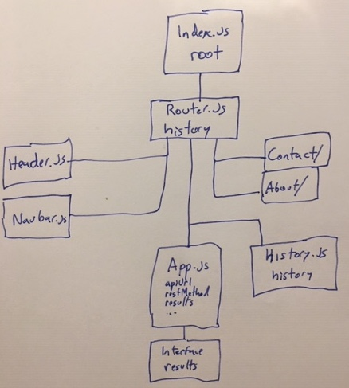

# RESTy_2

- To run server: `npm run start`
- To build front end: `npm run build`
- TO run tests: `npm run test`

### UML

### helpful links
- [Button class changing](https://jsfiddle.net/tkkqx2y2/)
- 
- [fetch error handling](https://gomakethings.com/error-handing-when-using-the-vanilla-js-fetch-method-with-async-and-await/)
- [reactjs.org lifting-state-up.html](https://reactjs.org/docs/lifting-state-up.html)
